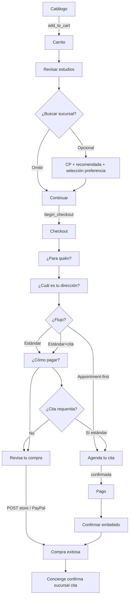

# UX/UI — Rediseño Carrito + Checkout de Laboratorios Famedic

**Fase:** Especificación UX/UI (sin implementación)  
**Fecha:** 2026-09-17  
**Estado:** Propuesta para revisión antes de desarrollo  
**Alcance:** Presentación sobre contratos existentes — sin cambios de lógica, backend, eventos ni integraciones

---

# 1. Objetivo

Diseñar una nueva experiencia de compra para Laboratorios Famedic que haga el flujo más sencillo, amigable, moderno y claro, reduciendo la saturación visual y la carga cognitiva.

**Flujo objetivo (conceptual):**

```
Catálogo → Carrito → Checkout → Paciente → Dirección → [Preferencia sucursal] → Pago → [Cita] → Revisión → Compra
```

**Lo que NO cambia:** lógica de negocio, endpoints, payloads, persistencia, pagos, ActiveCampaign, analytics, confirmación de cita por Concierge, compatibilidad operacional vs disponibilidad de cita.

**Lo que SÍ cambia (futuro):** capa de presentación — layout, jerarquía, copy orientado a decisiones, progressive disclosure, patrones mobile-first.

---

# 2. Principios UX

## 2.1 Principio rector

> **Una decisión importante a la vez.**

En cada pantalla el usuario debe entender inmediatamente:

1. **Dónde estoy** — contexto del flujo (carrito, paso 2 de 4, etc.)
2. **Qué necesito decidir** — una pregunta clara por paso
3. **Qué debo hacer** — CTA principal único y evidente
4. **Cuánto voy a pagar** — total siempre accesible
5. **Cómo continuar** — acción primaria sticky cuando aplique

## 2.2 Principios derivados

| Principio | Aplicación |
|-----------|------------|
| **Progressive disclosure** | Sucursales, municipios, detalles de estudio y resumen expandido bajo demanda |
| **Separación mental A/B/C** | A) Qué compro · B) Dónde puedo realizarlo (opcional) · C) Cuánto pago |
| **Preferencia ≠ confirmación** | Sucursal seleccionada es preferencia; cita confirmada es operación Concierge |
| **CP opcional** | Nunca bloquea continuar; mejora recomendaciones cuando existe |
| **Mobile nativo** | No es desktop en columna — bottom sheets, sticky CTA, priorización explícita |
| **Identidad Famedic** | Médica, confiable, humana — no marketplace genérico ni app financiera |
| **Inspiración Uber/Eats (solo patrones)** | Cards compactas, filtros, distancia, mapa bajo demanda, selección clara — **sin copiar visual** |

## 2.3 Tono de voz

- Directo y humano: preguntas en segunda persona ("¿Para quién son los estudios?")
- Evitar jerga técnica: no "Sucursal" para dirección del paciente
- Transparencia en cita: "coordinaremos contigo", no "reservado" ni "confirmado" hasta que aplique
- Calma médica: mensajes breves, sin alarmismo

---

# 3. Problemas actuales

Basado en la auditoría técnica (solo lectura):

| # | Problema | Impacto |
|---|----------|---------|
| 1 | Carrito mezcla estudios, totales, sucursales, CP, búsqueda, municipios y beneficios en una sola vista | Saturación; compiten por atención |
| 2 | Stepper checkout dice **"Sucursal"** pero el paso es **dirección del paciente** | Confusión con sucursal de laboratorio |
| 3 | Sucursales se renderizan completas (municipios, búsqueda, cards) desde el inicio | Abruma antes de decidir continuar |
| 4 | Sidebar checkout denso (items, cupones, promo, sucursal, acciones pago) | Dificulta foco en el paso actual |
| 5 | Mobile = stack vertical del desktop | Sin sticky CTA, sin bottom sheets, scroll excesivo |
| 6 | Tres conceptos de sucursal (recomendada / seleccionada / confirmada) no diferenciados en copy | Riesgo de expectativa incorrecta |
| 7 | FeaturesGrid y avisos al final del carrito compiten con decisión principal | Ruido visual |
| 8 | Posible doble evento GA4 `begin_checkout` (página + layout) | Hallazgo técnico — corregir en fase posterior, no en spec |

---

# 4. Arquitectura UX propuesta

## 4.1 Mapa de pantallas

```
┌─────────────────────────────────────────────────────────────┐
│ CARRITO                                                      │
│  ├─ Zona A: Estudios (primaria)                             │
│  ├─ Zona C: Resumen + Continuar (sticky desktop / mobile)   │
│  └─ Zona B: Sucursales (secundaria, collapsed / sheet)      │
└─────────────────────────────────────────────────────────────┘
                              ↓ Continuar
┌─────────────────────────────────────────────────────────────┐
│ CHECKOUT WIZARD                                              │
│  Step 1: Paciente                                            │
│  Step 2: Dirección (NO "Sucursal")                          │
│  Step 3: Pago                                                │
│  Step 4: Cita (condicional)                                  │
│  Step 5: Confirmar                                           │
│  + Resumen accesible (sidebar desktop / sheet mobile)       │
│  + Chip "Sucursal preferida" cuando exista en draft         │
└─────────────────────────────────────────────────────────────┘
                              ↓ Confirmar compra
┌─────────────────────────────────────────────────────────────┐
│ CONFIRMACIÓN (LaboratoryPurchase — fuera de alcance visual   │
│  salvo alineación menor de copy si aplica)                   │
└─────────────────────────────────────────────────────────────┘
```

## 4.2 Tres zonas del carrito (separación mental)

| Zona | Pregunta que responde | Prioridad visual |
|------|----------------------|------------------|
| **A — Estudios** | ¿Qué estoy comprando? | Alta — above the fold |
| **C — Resumen** | ¿Cuánto pago y cómo sigo? | Alta — sticky |
| **B — Sucursales** | ¿Dónde puedo realizarlo? (opcional) | Baja — secundaria, bajo demanda |

## 4.3 Flujos checkout (respetar variantes existentes)

| Variante | Pasos visibles | Condición backend |
|----------|----------------|-------------------|
| Estándar sin cita | Paciente → Dirección → Pago → Confirmar | `requiresAppointment = false` |
| Estándar con cita | Paciente → Dirección → Pago → Cita → Confirmar | Algún estudio `requires_appointment` |
| Appointment-first | Paciente → Dirección → Cita → Pago+Confirmar | `usesAppointmentFirstFlow = true` |

**Regla:** no inventar pasos; el stepper refleja `buildWizardSteps()` existente con labels humanizados.

---

# 5. Carrito Desktop

## 5.1 Layout (grid 12 columnas sugerido)

```
┌──────────────────────────────────────────────────────────────────┐
│ [Logo marca]  Carrito de laboratorio                              │
│               Revisa tus estudios antes de continuar.             │
├─────────────────────────────────────┬────────────────────────────┤
│ COL 8 — Contenido principal         │ COL 4 — Resumen sticky     │
│                                     │                            │
│ ▼ Estudios en tu carrito            │ Subtotal        $X,XXX.XX  │
│   [Card estudio 1]                  │ Descuento      −$XXX.XX   │
│   [Card estudio 2]                  │ ─────────────────────────  │
│   + Agregar más estudios            │ Total           $X,XXX.XX  │
│                                     │                            │
│ ▼ ¿Quieres encontrar una sucursal?  │ [ Crédito cupón si aplica] │
│   (collapsed por default)           │                            │
│                                     │ [    Continuar    ]        │
│ ▼ Aviso cita (solo si aplica)       │                            │
│   compacto, 1 línea + link          │                            │
└─────────────────────────────────────┴────────────────────────────┘
```

## 5.2 Header

- **Título:** Carrito de laboratorio
- **Subtítulo:** Revisa tus estudios antes de continuar.
- **Marca:** `LaboratoryBrandCard` — mantener, reducir padding si hace falta

## 5.3 Bloque A — Estudios en tu carrito

**Card compacta por estudio:**

| Elemento | Visible inicial | Bajo demanda |
|----------|-----------------|--------------|
| Nombre del estudio | ✓ | — |
| Precio Famedic | ✓ | — |
| Badge "Requiere cita" | ✓ solo si `requires_appointment` | — |
| Categoría / tipo | — | Expand "Ver detalles" (si hay data en props) |
| Descripción | — | Accordion inline |
| Eliminar | ✓ icono/texto "Quitar" | Modal confirmación (existente) |

**CTA único:** `+ Agregar más estudios` → ruta `laboratory-tests` (sin duplicar en layout).

**Comportamiento intacto:** `useDeleteLaboratoryCartItem` → DELETE `laboratory-cart-items.destroy`; GA4 `remove_from_cart` en handler existente.

## 5.4 Bloque C — Resumen (panel derecho sticky)

```
Subtotal          {formattedSubtotal}
Descuento         {formattedDiscount}   ← solo si > 0
─────────────────
Total             {formattedTotal}      ← tipografía destacada, navy

[BalanceCreditCard variant="cart"]      ← si aplica

[ Continuar ]                           ← primary, full width
```

- `position: sticky; top: 24px` — scroll independiente del contenido
- **No** incluir sucursales en este panel
- **Comportamiento intacto:** `handleCheckoutClick` → GA4 `begin_checkout` → navegación `laboratory.checkout?step=patient`

## 5.5 Bloque B — Sucursales (secundario, ver sección 7)

Estado inicial **colapsado**:

```
┌─────────────────────────────────────────────────┐
│ 📍 ¿Quieres encontrar una sucursal?        [▼] │
│    Opcional. Busca por código postal.           │
└─────────────────────────────────────────────────┘
```

Al expandir → experiencia sucursales (§7).

## 5.6 Elementos relegados / eliminados del fold principal

| Elemento actual | Propuesta |
|-----------------|-----------|
| `FeaturesGrid` | Mover debajo del fold o eliminar del carrito (link a "Beneficios Famedic" en footer) |
| Sección sucursales expandida por default | Collapsed hasta interacción |
| Debug GA4 panel | Mantener solo en `NODE_ENV === testing` |

---

# 6. Carrito Mobile

## 6.1 Prioridad vertical (top → bottom)

1. Header compacto + contador ("2 estudios")
2. Lista estudios (cards compactas)
3. Link `+ Agregar más estudios`
4. **Entry point sucursales** (no lista completa)
5. Aviso cita (1 línea, si aplica)
6. *(scroll)* — beneficios al final o omitidos

## 6.2 Wireframe conceptual

```
┌─────────────────────────────┐
│ ←  Carrito de laboratorio   │
├─────────────────────────────┤
│ 2 estudios                  │
│                             │
│ ┌─────────────────────────┐ │
│ │ Perfil tiroideo         │ │
│ │ $1,049.29        [Quitar]│ │
│ └─────────────────────────┘ │
│ ┌─────────────────────────┐ │
│ │ Química sanguínea       │ │
│ │ $1,861.29        [Quitar]│ │
│ └─────────────────────────┘ │
│                             │
│ + Agregar más estudios      │
│                             │
│ ┌─────────────────────────┐ │
│ │ 📍 Encontrar sucursal     │ │
│ │    compatible          → │ │
│ └─────────────────────────┘ │
│                             │
│         (espacio scroll)    │
├─────────────────────────────┤
│ Total          $2,910.58    │
│ [      Continuar →        ] │  ← sticky bottom bar
└─────────────────────────────┘
```

## 6.3 Sticky bottom bar (mobile)

- Altura mínima 64px + safe-area-inset-bottom
- Izquierda: label "Total" + monto grande
- Derecha o full-width: botón **Continuar →**
- Sombra sutil superior para separación
- **No** incluir sucursales ni búsqueda en la barra

## 6.4 Interacción sucursales mobile

Tap en **"Encontrar sucursal compatible"** → abre **Bottom Sheet** (§8).

**Comportamiento intacto:** mismos endpoints axios; solo cambia contenedor visual.

## 6.5 Touch targets

- Botones mínimo 44×44px
- Área tap "Quitar" separada del tap en card (evitar eliminaciones accidentales)

---

# 7. Sucursales Desktop

## 7.1 Contenedor (dentro de zona B expandida)

**Título sección:** ¿Quieres encontrar una sucursal?

**Subcopy según estado CP:**

| Estado | Copy intro |
|--------|------------|
| Sin CP | Encuentra sucursales compatibles para tus estudios. |
| CP resolved | Encontramos sucursales compatibles cerca de ti. |
| CP unresolved | Guardamos tu código postal. Aún no tenemos coordenadas para ordenar por distancia. |

## 7.2 Código postal

```
[ Código postal (5 dígitos)     ] [ Buscar ] [ Limpiar ]
```

- Input: `sanitizePostalCodeInput` — solo dígitos, max 5
- Validación client: `validateMexicanPostalCodeForSearch`
- **Comportamiento intacto:**
  - GET `laboratory.cart.compatible-stores?brand=X&postal_code=XXXXX`
  - Clear: `clear_postal_code=1`
  - Persistencia en `laboratory_checkout_drafts.postal_code`

## 7.3 Tabs / filtros (presentación sobre datos existentes)

```
[ Recomendadas ] [ Todas ] [ Filtros ▾ ] [ Ver mapa ]
```

| Tab | Contenido | Fuente datos |
|-----|-----------|--------------|
| **Recomendadas** | 1 destacada + 2–3 alternativas | `nearestCompatibleBranch()` + top by distance |
| **Todas** | Lista completa compatible | `compatibleBranches(branches)` |
| **Filtros** | Búsqueda texto (existente `filterBranchesBySearch`) | Sin nuevos filtros backend |
| **Ver mapa** | Panel lateral Leaflet (si ya existe infra) o placeholder "Próximamente" | Solo si hay coords en branches — **no inventar pins** |

**Nota:** "Filtros" en v1 = búsqueda por nombre/dirección/municipio. No agregar filtros de capacidad sin endpoint.

## 7.4 Card sucursal recomendada (destacada)

```
┌─────────────────────────────────────────────────────┐
│ ⭐ Recomendada para ti                    2.3 km     │
│ Laboratorio Vasconcelos                               │
│ Av. Vasconcelos 123, San Pedro                      │
│ Compatible · Lun–Vie 7:00–19:00                     │
│                                                     │
│ [ Seleccionar sucursal ]  o  [ ✓ Seleccionada ]    │
└─────────────────────────────────────────────────────┘
```

- Badge "Recomendada" — visual only, basada en `nearestCompatibleBranch`
- Distancia solo si `distanceKm` presente
- Horarios: informativos — copy tooltip: "Horario referencial. La cita se confirma después."
- **Seleccionar:** POST `laboratory.checkout.selected-store.store` `{ laboratory_store_id }`
- **Deseleccionar:** DELETE `laboratory.checkout.selected-store.destroy`
- Toggle: si ya seleccionada, tap deselecciona (comportamiento actual)

## 7.5 Alternativas y municipios

Después de la recomendada:

```
Otras opciones cerca de ti
[ Card sucursal 2 ]  [ Card sucursal 3 ]

──────────────────────────────────────
Más sucursales por zona

▸ Monterrey (4)          ← accordion collapsed
▸ San Pedro (2)
▸ Guadalupe (3)
```

- Máximo **3 municipios visibles collapsed**; resto bajo "Ver todas las zonas"
- Dentro de accordion: filas compactas (nombre, distancia, botón seleccionar)
- **No** mostrar 10+ municipios abiertos simultáneamente

## 7.6 Estados vacíos / error

Ver §12.

---

# 8. Sucursales Mobile

## 8.1 Bottom Sheet — "Encuentra una sucursal"

**Trigger:** tap "Encontrar sucursal compatible" en carrito.

**Estructura:**

```
┌─────────────────────────────┐
│ ─── (drag handle)           │
│ Encuentra una sucursal   [✕]│
│ Opcional · Compatible con   │
│ tus estudios                │
├─────────────────────────────┤
│ [ CP input        ] [Buscar]│
├─────────────────────────────┤
│ ⭐ Recomendada              │
│ [ Card sucursal ]           │
│                             │
│ [ Ver más sucursales ]      │  ← expande lista in-sheet
├─────────────────────────────┤
│ (scroll)                    │
└─────────────────────────────┘
```

- Sheet height: ~85vh max, scroll interno
- "Ver más sucursales" revela tabs Recomendadas/Todas o lista accordion municipios
- Mapa: full-screen modal secundario (opcional fase posterior) — solo si hay coordenadas

## 8.2 Selección en sheet

- Al seleccionar: feedback inline "Sucursal guardada como preferencia" + checkmark
- Sheet puede cerrarse; preferencia persiste en draft
- **Copy obligatorio:** "Esta es una preferencia. La sucursal final se confirma al agendar tu cita."

## 8.3 Comportamiento intacto

| Acción | Endpoint | Payload |
|--------|----------|---------|
| Cargar sucursales | GET `laboratory.cart.compatible-stores` | `brand`, `postal_code?`, `clear_postal_code?` |
| Cargar selección | GET `laboratory.checkout.selected-store.show` | brand en URL |
| Guardar | POST `laboratory.checkout.selected-store.store` | `{ laboratory_store_id }` |
| Quitar | DELETE `laboratory.checkout.selected-store.destroy` | — |

---

# 9. Checkout Desktop

## 9.1 Layout general

```
┌──────────────────────────────────────────────────────────────────┐
│ Stepper horizontal (5 pasos max)                                  │
├─────────────────────────────────────┬────────────────────────────┤
│ COL 8 — Paso actual                 │ COL 4 — Resumen compacto   │
│                                     │                            │
│ [CheckoutWizardStep]                │ 2 estudios · $2,910.58     │
│ Contenido del paso                  │ [Ver detalles ▾]           │
│                                     │                            │
│                                     │ Sucursal preferida (chip)  │
│                                     │                            │
│                                     │ [Continuar] o [Confirmar]  │
├─────────────────────────────────────┴────────────────────────────┤
│ Footer flotante pasos intermedios (existente, simplificado)      │
└──────────────────────────────────────────────────────────────────┘
```

## 9.2 Stepper humanizado

**Labels (UI) → IDs técnicos (intactos):**

| Label UI | ID backend | Icono sugerido |
|----------|------------|----------------|
| ¿Para quién? | `patient` | persona |
| Tu dirección | `address` | casa/map pin |
| Pago | `payment` | tarjeta |
| Agenda tu cita | `appointment` | calendario |
| Confirmar | `confirmation` | check |

**Estados stepper:** completado (✓), actual (●), pendiente (○), deshabilitado (gris).

**Justificación "Tu dirección" vs "¿Cuál es tu dirección?":**
- Stepper: **"Tu dirección"** — corto, escaneable
- Título del paso: **"¿Cuál es tu dirección?"** — pregunta completa para la decisión
- **Nunca** usar "Sucursal" en este paso

## 9.3 Step 1 — Paciente

**Título:** ¿Para quién son los estudios?  
**Subtítulo:** Selecciona al paciente que realizará los estudios.

**Card paciente (selección):**

```
┌─────────────────────────────────────────┐
│ ○  María López García                   │
│    Femenino · 12/05/1985 · ···1234      │
└─────────────────────────────────────────┘
```

- Radio visual / borde accent cuando seleccionado
- Datos de props `contacts` existentes
- **+ Agregar nuevo paciente** → expande `ContactForm` (existente)
- **Continuar** → POST draft `{ step: "patient", contact_id }` vía `syncCheckoutDraft`

## 9.4 Step 2 — Dirección

**Título:** ¿Cuál es tu dirección?  
**Subtítulo:** La usaremos para tu expediente y comunicación sobre tus resultados.

**Card dirección:**

```
┌─────────────────────────────────────────┐
│ ○  Av. Constitución 100, Col. Centro    │
│    Monterrey, NL · CP 64000             │
└─────────────────────────────────────────┘
```

- **+ Nueva dirección** → `AddressForm` existente
- **Chip sucursal preferida** (si draft válido) — debajo del formulario, NO mezclado:

```
┌─────────────────────────────────────────┐
│ 📍 Sucursal preferida                   │
│    Vasconcelos · San Pedro              │
│    [Cambiar]  → link a carrito#sucursales o expand inline read-only │
└─────────────────────────────────────────┘
```

**Copy chip:** "Preferencia guardada. No reserva cita ni garantiza disponibilidad."

**Comportamiento intacto:** draft sync `{ step: "address", address_id }`; `selectedLaboratoryStore` de props Inertia.

## 9.5 Step 3 — Pago

**Título:** ¿Cómo quieres pagar?

**Cards selección** (reemplazo visual de `CheckoutSelectionCard`):

```
┌─────────────────────────────────────────┐
│ ○  Visa ···· 4242                       │
│    Exp 12/28                            │
└─────────────────────────────────────────┘
┌─────────────────────────────────────────┐
│ ○  PayPal                               │
└─────────────────────────────────────────┘
┌─────────────────────────────────────────┐
│ ○  Caja de ahorro Odessa                │
└─────────────────────────────────────────┘
```

- Mostrar solo métodos disponibles según props (`hasPayPal`, `hasOdessaPay`, `paymentMethods`)
- Agregar tarjeta → link existente `payment-methods.create?return_url=...`
- Promo/código: `PromoCodeField` — colapsable "¿Tienes un código promocional?"
- **Comportamiento intacto:** `payment_method` values, PayPal eligibility hook, mock mode

## 9.6 Step Cita (condicional)

**Título:** Agenda tu cita  
**Subtítulo:** Un especialista de Famedic te contactará para confirmar fecha, hora y sucursal.

**Bloques:**

1. **Estado cita** — badge pendiente / confirmada (`laboratoryAppointment.confirmed_at`)
2. **Acciones contacto** — WhatsApp, llamada (phone-intent POST existente)
3. **Preferencia callback** — formulario horario/comentario (PATCH callback-availability)
4. **Polling** — indicador sutil "Actualizando estado…" cada 10s (sin cambiar intervalo)

**Copy obligatorio:**
- "La sucursal que elegiste en el carrito es una preferencia."
- "Concierge confirmará la sucursal y horario contigo."
- Si confirmada: "Tu cita fue confirmada para {fecha} en {sucursal confirmada}."

**NO decir:** "Tu sucursal está reservada" basándose solo en draft.

## 9.7 Step Confirmación

**Título:** Revisa tu compra

**Filas editables compactas:**

| Sección | Contenido | Acción |
|---------|-----------|--------|
| Paciente | Nombre | [Cambiar] → `goToStep("patient")` |
| Dirección | Calle, ciudad | [Cambiar] → `goToStep("address")` |
| Sucursal preferida | Nombre + municipio (si valid) | [Cambiar] → carrito sucursales |
| Pago | Visa ····4242 / PayPal / etc. | [Cambiar] → `goToStep("payment")` |
| Cita | Estado resumido (si aplica) | [Cambiar] → `goToStep("appointment")` |

**Total prominente:** $2,910.58 MXN

**CTA:** Confirmar compra {total} — o `LaboratoryPayPalButton` si PayPal seleccionado

**Comportamiento intacto:** POST `laboratory.checkout.store` / PayPal create+capture

## 9.8 Sidebar resumen (simplificado)

**Visible siempre:**
- N estudios · Total
- CTA del paso

**Bajo "Ver detalles" (accordion):**
- Lista estudios con precios
- Descuento
- Cupón/promo aplicado
- Sucursal preferida (1 línea)

**Eliminar del sidebar por default:**
- Formularios de pasos duplicados
- Textos legales largos (mover a confirmación)

---

# 10. Checkout Mobile

## 10.1 Stepper mobile

- Progress dots + "Paso 2 de 4"
- Título pregunta grande debajo

## 10.2 Navegación

- **Volver** — top-left o footer flotante existente (`CheckoutWizardFloatingFooter`)
- **Continuar** — sticky bottom bar

## 10.3 Sticky bottom bar checkout

```
┌─────────────────────────────┐
│ Total          $2,910.58    │
│ [ Continuar →             ] │
└─────────────────────────────┘
```

En paso confirmación:

```
┌─────────────────────────────┐
│ Total          $2,910.58    │
│ [ Confirmar compra        ] │
└─────────────────────────────┘
```

## 10.4 Resumen mobile — bottom sheet

**Trigger:** link "Ver resumen (2 estudios)" sobre la sticky bar.

**Contenido sheet:**
- Lista estudios
- Subtotal / descuento / total
- Sucursal preferida
- Cupón aplicado

**Comportamiento:** read-only; no reemplaza paso confirmación.

## 10.5 Paciente / dirección mobile

- Una card por opción; scroll vertical
- Formulario nuevo paciente/dirección: full-screen slide o sheet secundario

## 10.6 Pago mobile

- Cards full-width apiladas
- PayPal: botón SDK ancho completo en confirmación (layout existente)

---

# 11. Progressive Disclosure

| Información | Inicial | Interacción | Accordion | Bottom sheet |
|-------------|---------|-------------|-----------|--------------|
| Lista estudios carrito | ✓ | — | — | — |
| Precio por estudio | ✓ | — | — | — |
| Descripción estudio | — | Tap "Ver detalles" | ✓ inline | — |
| Badge "Requiere cita" | ✓ si aplica | — | — | — |
| Subtotal/descuento/total | ✓ resumen | — | — | — |
| Botón Continuar | ✓ sticky | — | — | — |
| Sección sucursales completa | — | Expand / tap entry | — | ✓ mobile |
| Input código postal | — | ✓ al expandir/sheet | — | ✓ mobile |
| Sucursal recomendada | — | ✓ post-CP o expand | — | ✓ |
| 2–3 alternativas | — | ✓ | — | ✓ "Ver más" |
| Municipios restantes | — | — | ✓ | ✓ in-sheet |
| Búsqueda sucursal | — | Tab Filtros | — | ✓ |
| Mapa sucursales | — | Tab "Ver mapa" | — | Modal full-screen |
| Requisitos matched/missing | — | Tap card sucursal | ✓ | ✓ |
| Horarios sucursal | ✓ 1 línea en card | — | — | — |
| FeaturesGrid beneficios | — | — | — | — (footer o omitir) |
| Lista pacientes checkout | ✓ paso 1 | — | — | — |
| Form nuevo paciente | — | ✓ tap agregar | — | ✓ sheet mobile |
| Sucursal preferida checkout | ✓ chip compacto | — | — | ✓ en resumen sheet |
| Métodos de pago | ✓ paso pago | — | — | — |
| Código promocional | — | ✓ "¿Tienes código?" | — | — |
| Detalle resumen checkout | — | ✓ "Ver detalles" | ✓ desktop sidebar | ✓ mobile |
| Estado cita + callback | ✓ paso cita | — | — | — |
| Filas revisión confirmación | ✓ paso final | [Cambiar] navega | — | — |
| Términos legales | — | — | — | Solo en confirmación |

---

# 12. Estados

## 12.1 Carrito — sucursales (`compatibleStoresUiState`)

| Estado | Visual | Copy | Acciones |
|--------|--------|------|----------|
| `loading` | Skeleton 1 card + 2 líneas | — | — |
| `error` | Banner amber + icono | No pudimos cargar las sucursales. | [Reintentar] → `loadStores()` |
| `empty` | Ilustración mínima | Agrega estudios para ver sucursales compatibles. | Link catálogo |
| `unresolved` | Info azul | Necesitamos revisar los requisitos de tus estudios. | Continuar sin sucursal |
| `no-compatible` | Info neutral | No encontramos sucursales compatibles con tus estudios. | Continuar |
| `ready` | Tabs + recomendada | Según CP (§7.1) | Buscar, seleccionar |

## 12.2 Código postal

| Estado | Visual input | Copy auxiliar |
|--------|--------------|---------------|
| `missing` | Placeholder "Ej. 64000" | Opcional. Ayuda a ordenar por cercanía. |
| `resolved` | CP visible + ✓ sutil | Encontramos sucursales cerca de ti. |
| `unresolved` | CP visible + ⚠ info | No tenemos coordenadas para este CP. Mostramos sucursales compatibles sin orden por distancia. |
| Validación error | Borde rojo + texto | Mensajes de `validateMexicanPostalCodeForSearch` |

## 12.3 Selección sucursal (`checkoutSelectedStoreUiState`)

| Estado | Visual card/chip | Copy |
|--------|------------------|------|
| `missing` | Sin chip / entry point neutral | Opcional |
| `valid` | Chip verde suave + nombre | Sucursal preferida |
| `stale` | Chip amber | Actualiza tu preferencia — cambiaste estudios |
| `invalid` | Chip amber | Elige otra sucursal compatible |

## 12.4 Cita

| Estado | Visual | Copy |
|--------|--------|------|
| Pendiente | Pulso suave amber | Estamos coordinando tu cita |
| Confirmada | Check verde | Cita confirmada · {fecha} · {sucursal confirmada} |
| Callback guardado | Texto secundario | Preferiste que te llamemos · {hora formateada} |
| Appointment-first bloqueado | CTA pago disabled + tooltip | Confirma tu cita antes de pagar |

## 12.5 Pago

| Estado | Visual |
|--------|--------|
| Seleccionando | Card con borde accent |
| Error (`errors.payment_method`) | Banner rojo sobre cards |
| Total $0 cupón | Mensaje "Tu compra está cubierta" + auto coupon_balance |
| Procesando | Spinner en CTA, disabled |

## 12.6 Éxito post-compra

Fuera de alcance rediseño mayor — `LaboratoryPurchase.jsx` mantiene GA4 `purchase`. Alineación visual menor en fase posterior.

---

# 13. Componentes visuales propuestos

**Solo especificación — NO implementar en Fase 1.**

| Componente propuesto | Propósito | Basado en |
|---------------------|-----------|-----------|
| `CompactStudyCard` | Item carrito | Extiende visual de `CartItem` |
| `StickySummaryBar` | Mobile carrito/checkout | Nuevo contenedor |
| `BranchBottomSheet` | Sucursales mobile | Wrap `LaboratoryCompatibleStoresSection` |
| `BranchRecommendCard` | Sucursal destacada | Datos `CompatibleLaboratoryStoreResource` |
| `BranchCompactRow` | Fila en accordion municipio | — |
| `CollapsibleBranchSection` | Entry point desktop | — |
| `BranchTabBar` | Recomendadas/Todas/Mapa | UI only |
| `PreferredStoreChip` | Checkout sidebar/paso 2 | `checkoutSelectedStorePresentation` |
| `HumanStepper` | Checkout steps | Wrap `CheckoutStepper` |
| `SelectionCard` | Paciente/dirección/pago | Evolución `CheckoutSelectionCard` |
| `ReviewRow` | Confirmación editable | — |
| `CheckoutSummarySheet` | Resumen mobile | — |
| `ProgressDots` | Stepper mobile | — |

**Design tokens sugeridos (Fase implementación 1):**

| Token | Valor sugerido |
|-------|----------------|
| `--fm-navy` | Institucional existente |
| `--fm-blue-soft` | Fondos info |
| `--fm-success-soft` | Preferencia válida |
| `--fm-warning-soft` | Stale / pendiente |
| `--radius-card` | 12px |
| `--shadow-sticky` | 0 -4px 12px rgba(0,0,0,0.08) |
| `--space-section` | 24px desktop / 16px mobile |

---

# 14. Responsive behavior

| Componente | Desktop (≥1024px) | Tablet (768–1023px) | Mobile (<768px) |
|------------|-------------------|---------------------|-----------------|
| Cart layout | 8+4 grid | 8+4 o stack resumen abajo sticky | Single column + sticky bar |
| Cart summary | Sidebar sticky | Sticky bottom o sidebar estrecho | Sticky bottom bar |
| Branch section | Collapsible inline | Collapsible inline | Bottom sheet |
| Branch tabs | Horizontal inline | Horizontal scroll | Segmented en sheet |
| Map | Side panel 40% | Overlay 50% | Full-screen modal |
| Municipality groups | Accordion max 3 visible | Accordion | Accordion in-sheet |
| Checkout layout | 8+4 grid | Similar | Full width step |
| Checkout summary | Sidebar compacto | Collapsed accordion | Bottom sheet |
| Stepper | Horizontal labels | Horizontal compact | Dots + título |
| CTA primary | Sidebar o footer paso | Sticky bottom | Sticky bottom |
| Contact/address forms | Inline expand | Inline | Sheet full-screen |
| PayPal button | Width sidebar | Full width | Full width |

**Breakpoints:** alinear con Tailwind existente (`lg:`, `md:`).

---

# 15. Accesibilidad

| Requisito | Especificación |
|-----------|----------------|
| Contraste texto | WCAG AA mínimo 4.5:1 body, 3:1 large text |
| Touch targets | 44×44px mínimo mobile |
| Focus visible | Ring 2px navy en cards seleccionables |
| Keyboard | Tab order: contenido → CTA → secundarios; Enter/Space selecciona cards |
| Labels | Inputs CP, forms con `<label>` visible o `aria-label` |
| Errores | `aria-live="polite"` en errores sucursales (ya existe) — extender a pago |
| Selección | `aria-pressed` en cards sucursal; `aria-checked` en radio paciente/dirección |
| Stepper | `aria-current="step"` en paso activo |
| Bottom sheet | Focus trap; Esc cierra; restore focus al trigger |
| Screen reader | "Sucursal preferida, opcional, Vasconcelos, San Pedro" — incluir "opcional" |
| Motion | Respetar `prefers-reduced-motion` — sin animaciones sheet agresivas |

---

# 16. Qué permanece intacto

## 16.1 Rutas y endpoints

| Acción | Ruta | Método |
|--------|------|--------|
| Agregar estudio | `laboratory-cart-items.store` | POST |
| Eliminar estudio | `laboratory-cart-items.destroy` | DELETE |
| Ver carrito | `laboratory.shopping-cart` | GET Inertia |
| Compatible stores | `laboratory.cart.compatible-stores` | GET axios |
| Selected store CRUD | `laboratory.checkout.selected-store.*` | GET/POST/DELETE |
| Checkout | `laboratory.checkout` | GET Inertia |
| Sync draft | `laboratory.checkout.draft.sync` | POST |
| Sync appointment | `laboratory.checkout.appointment.sync` | POST |
| Promo validate/destroy | `laboratory.checkout.promo-codes.*` | POST/DELETE |
| Compra | `laboratory.checkout.store` | POST |
| PayPal | `paypal.create-order`, `paypal.capture-order` | POST |
| Phone intent | `laboratory-appointments.phone-intent` | POST |
| Callback | `laboratory-appointments.callback-availability` | PATCH |

## 16.2 Payloads críticos

```json
// POST selected-store
{ "laboratory_store_id": 42 }

// GET compatible-stores query
{ "brand", "postal_code?", "clear_postal_code?", "latitude?", "longitude?", "date?" }

// POST draft sync
{ "step", "contact_id", "address_id", "payment_method", "coupon_id", "promo_validation_token" }

// POST checkout.store
{ "total", "contact", "address", "payment_method", "coupon_id", "promo_validation_token", "laboratory_appointment" }
```

## 16.3 Lógica backend (no tocar)

- `BranchResolver`, `CartRequirementAggregator`, `StudyRequirementResolver`
- `PostalCodeLocationResolver`
- `SelectedLaboratoryStoreDraftService` (validación, cart hash, stale)
- `LaboratoryCheckoutStepGuard`
- `OrderAction`, `FulfillLaboratoryCartOrderAction`
- `laboratory_appointments.laboratory_store_id` — solo Concierge confirma
- `meta.availability_scope = operational_capability_only`

## 16.4 Estado frontend (no cambiar contratos)

- `sessionStorage` key `laboratory-checkout-wizard:{brand}`
- URL query `?step=patient&contact=…`
- Inertia shared `laboratoryCarts`
- `useForm` fields en `LaboratoryCheckout.jsx`

---

# 17. Eventos que no deben tocarse

| Evento | Momento | Archivo |
|--------|---------|---------|
| GA4 `view_cart` | Mount carrito | `LaboratoryShoppingCart.jsx` |
| GA4 `remove_from_cart` | Eliminar ítem | Página + layout |
| GA4 `begin_checkout` | Click Continuar | Página + layout |
| GA4 `select_item` | Carrito vacío → catálogo | `LaboratoryShoppingCart.jsx` |
| GA4 `add_to_cart` / `view_item` | Catálogo | `ProductCard.jsx` |
| GA4 `purchase` | Confirmación compra | `LaboratoryPurchase.jsx` |
| FB `AddToCart` | POST cart item | Server |
| FB `InitiateCheckout` | GET checkout | Server |
| FB `Purchase` | POST compra tarjeta | Server |
| `fbq` browser | Inertia props | `useTrackingEvents.js` |
| AC `vgo("process")` | Navegación | `activeCampaignSiteTracking.js` |
| Phone intent POST | WhatsApp/tel cita | `LaboratoryAppointmentStep.jsx` |

**Recomendación fase posterior:** consolidar doble `begin_checkout` — no en rediseño visual inicial.

---

# 18. ActiveCampaign que no debe tocarse

- Site tracking rules y exclusiones URL
- Outbox cart events (`famedic_cart_abandoned`, `_resumed`, `_recovered`)
- Tags: carrito agregado (19), abandonado (20), compra lab (18), cita pendiente, llamada
- Custom fields lab: `paciente_lab`, `sucursal_lab`, `fecha_cita_lab`, `url_finalizar_compra`, etc.
- `LaboratoryAppointmentConfirmationSignalService` — dispara al confirmar Concierge
- GDA webhooks → tags muestra/resultados
- Feature flags AC en `config/services.php`

**El rediseño no debe cambiar:** timing de triggers, condiciones, payloads AC, nombres de site events.

---

# 19. Pagos que no deben tocarse

| Integración | Contrato |
|-------------|----------|
| EfevooPay | Token IDs en `payment_method`; charge via `ChargeEfevooPaymentMethodAction` |
| PayPal | SDK + `createLaboratoryPayPalHandlers.js`; create/capture endpoints |
| Odessa | `payment_method = "odessa"` |
| Cupón/promo $0 | `payment_method = "coupon_balance"` |
| Mock mode | `paymentUsesMock`, `defaultMockPaymentMethodId` |
| Validación total | Server recalcula — client envía `total` |
| Payment errors | `errors.payment_method` mapping |
| Pago sucursal GDA | UI oculta — no habilitar sin plan explícito |

**Rediseño:** solo contenedores visuales alrededor de botones/handlers existentes.

---

# 20. Analytics que no debe tocarse

- GTM container `GTM-T39QLNX6`
- GA4 property `G-F5VNYJNMBP`
- Estructura `dataLayer.push({ event, ecommerce })`
- Hotjar `hjid: 6467565`
- Facebook CAPI dedup via `eventID`
- **No agregar** nuevos eventos GA4 en checkout sin plan de analytics separado

---

# 21. Persistencia que no debe tocarse

## `laboratory_checkout_drafts`

| Campo | Uso UX |
|-------|--------|
| `postal_code` | Rehidratación CP en carrito |
| `selected_laboratory_store_id` | Chip "Sucursal preferida" |
| `selected_laboratory_store_cart_hash` | Detección stale |
| `contact_id`, `address_id` | Pre-fill checkout |
| `payment_method`, `coupon_id`, `promo_validation_token` | Paso pago |
| `checkout_step` | Step guard |

## Otras

- `laboratory_cart_items` — items carrito
- `laboratory_appointments.laboratory_store_id` — **confirmada**, no draft
- `sessionStorage` wizard index

---

# 22. Flujo final propuesto



**Punto clave:** la preferencia de sucursal se guarda en carrito (opcional) y se muestra como chip en checkout; la sucursal operativa se confirma después en `laboratory_appointments` por Concierge.

---

# 23. Plan de implementación

Secuencia ajustada por seguridad (UI desacoplada de contratos críticos primero):

| Fase | Objetivo | Archivos principales | Riesgo | Tests |
|------|----------|---------------------|--------|-------|
| **1** | Design tokens + primitivos visuales (cards, chips, sticky bar, sheet) | Nuevos componentes UI only | 🟢 | Visual |
| **2** | Carrito desktop — zona A + C (estudios + resumen) sin tocar sucursales | `LaboratoryShoppingCart`, `ShoppingCartLayout` | 🟡 | GA4 manual |
| **3** | Carrito mobile — sticky bar + reorder | ↑ | 🟡 | Responsive QA |
| **4** | Sucursales desktop — collapsible + tabs + recomendada | `LaboratoryCompatibleStoresSection`, lib copy | 🟡 | `LaboratoryCompatibleStoresEndpointTest`, JS tests |
| **5** | Sucursales mobile — bottom sheet | ↑ | 🟡 | Selected store tests |
| **6** | Checkout stepper labels + paciente + dirección | `LaboratoryCheckout`, `ContactStep`, `AddressStep`, `CheckoutStepper` | 🟡 | Draft sync tests |
| **7** | Checkout pago — cards visuales | `PaymentMethodStep` | 🔴 | `CartPaymentMethodSelectedTest` |
| **8** | Paso cita — copy + layout | `LaboratoryAppointmentStep` | 🔴 | Appointment-first tests |
| **9** | Confirmación + sidebar resumen | `ConfirmationStep`, `CheckoutLayout` | 🔴 | Integration purchase |
| **10** | Responsive polish + accesibilidad | Transversal | 🟡 | a11y audit |
| **11** | Regression testing | — | — | Suite completa §24 |

**Dependencias:**
- Fases 4–5 dependen de 2–3 (layout carrito estable)
- Fase 7 depende de 6 (wizard navegable)
- Fase 9 depende de 7–8

---

# 24. Riesgos

| Riesgo | Probabilidad | Impacto | Mitigación |
|--------|--------------|---------|------------|
| Usuario cree que preferencia = cita confirmada | Media | Alto | Copy obligatorio §7–9; chip "preferida" |
| Romper POST selected-store al mover UI | Baja | Alto | Mismos handlers; tests selected-store |
| PayPal deja de renderizar | Baja | Crítico | No tocar `LaboratoryPayPalButton` internals |
| GA4 duplicado empeora métricas | Media | Medio | Fase posterior: un solo emisor begin_checkout |
| Bottom sheet rompe focus/a11y | Media | Medio | Focus trap spec §15 |
| Step guard redirect loops | Baja | Alto | No cambiar step IDs |
| CP parece requerido | Media | Medio | Label "Opcional" persistente |
| Sidebar checkout pierde CTA pago | Media | Alto | CTA siempre en sticky/sidebar |

---

# 25. Criterios de aceptación

## UX

- [ ] Usuario identifica en <3s qué está comprando en carrito
- [ ] Una acción principal visible por viewport (Continuar / Confirmar)
- [ ] Sucursales no visibles hasta interacción explícita (mobile sheet / desktop expand)
- [ ] Step dirección nunca dice "Sucursal"
- [ ] Tres tipos de sucursal diferenciados en copy (recomendada / preferida / confirmada)
- [ ] CP claramente opcional — checkout avanza sin CP ni preferencia
- [ ] Mobile tiene sticky CTA — no requiere scroll para continuar
- [ ] Resumen accesible en ≤2 taps mobile
- [ ] Paso cita explica coordinación posterior y rol Concierge

## Técnicos (regression)

- [ ] Todos endpoints §16.1 responden igual
- [ ] Payloads §16.2 sin cambios
- [ ] Eventos §17 disparan en mismos momentos
- [ ] AC §18 sin cambios comportamiento
- [ ] Pagos §19 flujos tarjeta/PayPal/Odessa/cupón OK
- [ ] `laboratory_checkout_drafts` persiste igual
- [ ] `appointment.laboratory_store_id` solo vía Concierge
- [ ] Tests §23 fase 11 pasan

## Checklist final propuesta

- [x] Menos información simultánea
- [x] Una acción principal por pantalla
- [x] Carrito fácil de entender
- [x] Checkout fácil de entender
- [x] Sucursales sin saturar carrito
- [x] Mobile específico
- [x] Resumen accesible
- [x] Sucursal recomendada ≠ confirmada
- [x] CP opcional
- [x] Cita ≠ selección sucursal
- [x] Contratos intactos

---

## Apéndice A — Trazabilidad visual → comportamiento

| Elemento UI propuesto | Comportamiento existente |
|-----------------------|-------------------------|
| Botón "Seleccionar sucursal" | POST `selected-store.store` `{ laboratory_store_id }` |
| Botón "Quitar selección" / toggle | DELETE `selected-store.destroy` |
| Botón "Buscar" CP | GET `compatible-stores` + persist `postal_code` |
| "Limpiar" CP | GET con `clear_postal_code=1` |
| "Continuar" carrito | GA4 begin_checkout + `window.location` → checkout patient |
| Card paciente | `setData("contact", id)` + draft sync |
| Card dirección | `setData("address", id)` + draft sync |
| Card pago | `setData("payment_method", value)` |
| "Confirmar compra" | POST `checkout.store` o PayPal handlers |
| WhatsApp / Llamada cita | POST phone-intent |
| Chip sucursal preferida [Cambiar] | Navegar a carrito sección sucursales — no POST appointment |

---

## Apéndice B — Copy bank (propuesto)

| Contexto | Copy |
|----------|------|
| Entry sucursales | ¿Quieres encontrar una sucursal? |
| CP opcional | Opcional. Nos ayuda a mostrarte opciones cercanas. |
| Preferencia guardada | Guardamos tu preferencia. La cita y sucursal final se confirman contigo. |
| Horarios sucursal | Horario referencial |
| Cita pendiente | Estamos coordinando tu cita. Te contactaremos pronto. |
| Cita confirmada | Tu cita está confirmada |
| Stale preferencia | Actualiza tu preferencia de sucursal — cambiaste los estudios de tu carrito |

---

*Documento generado en Fase 1 — Especificación UX/UI. Sin implementación de código.*
